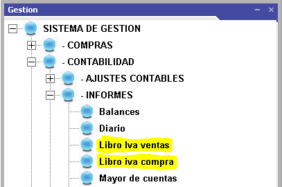
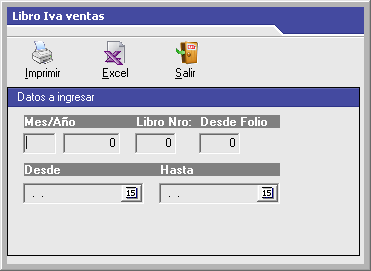
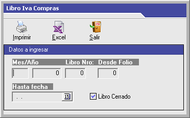
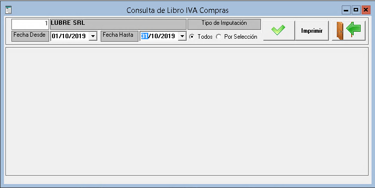
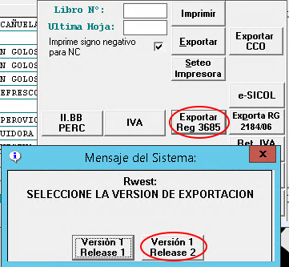
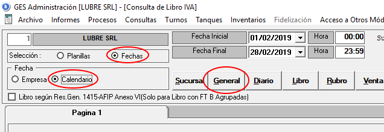
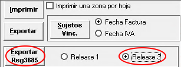

# CITI (RG3685)

Este procedimiento lo realizaremos con dos meses de retraso, en marzo prepararemos el CITI de enero

Las referencias a cualquier archivo o carpeta se encontrarán alojados (o exportados) a la carpeta de trabajo, que en este caso sera:

*D:\Usuarios\Roberto\Documents\AFIP\citi*

Para comenzar es necesario obtener el **Libro IVA Ventas** y **Libreo IVA Compras** de Lubre.

| - | - |
| --- | --- |
|  | Al seleccionar cada libro, debe definir el período deseado y exportar los datos a *Excel* |
|  |  |

Al resultado obtenido en excel lo pegamos a las solapas respectivas del archivo Ventas.ods o Compras.ods y después realizamos la limpieza de la información de la siguiente manera:

### Libro IVA Compras

Eliminamos todas las líneas que no tienen IVA.

Corregimos las fechas que no corresponden al período soliciado.

Cambiar los Puntos de ventas iguales a 0 por 1 (esto lo hace la planilla automáticamente)

Revisar las líneas que tengan más de 1 alícuota generando la información desde la solapa *Indicaciones*.

### Libro IVA Ventas

Revisar que todos los CUIT estén informados, no debe faltar ninguno. Revisar los totales de los comprobantes NDE y NCR.

Cuando haya una nota de debito que sea por un monto no gravado por iva, y ese monto sea el total de la nota, se pone cantidad de alicuotas 1 y codigo de operación N

# DEBO

### Libro IVA Compras

Ingresamos al perfil Informes / Proveedores / Libro IVA Compras, seleccionamos el rango de fechas y pulsamos en general. 

Una vez obtenido el informe, pulsamos en **Imprimir** y seleccionamos **Exportar Reg3685** (release 1). Esto creará dos archivos de texto llamados CITI.txt y CITI_ALI.txt los cuales guardaremos para poder procesarlos.

NOTA: el **release 1** tiene menos errores.

### Libro IVA Ventas

Ingresamos al perfil de Administración / Consultas / Libro IVA Ventas, seleccionamos rango de fechas, elegimos la opción **Calendario** y pulsamos en <u>General</u>.

Una vez obtenido el listado, pulsamos en **Imprimir** y seleccionamos **Exportar Reg3685** (release 1). Esto creará dos archivos de texto llamados LbIVACITI.txt y ALI_LbIVACITI.txt los cuales guardaremos para poder procesarlos.

NOTA: el **release 1** tiene menos errores.

Para poder manejar los archivos correctamente, renombar el archivo ALI_LbIVACITI.txt por LbIVACITI_ALI.txt 

El archivo resultante tiene varios errores que debemos corregir antes de procesar los datos.

1. Reemplazamos las líneas con total > 1000 y tipo de documento igual a 99. Modificamos el tipo de documento a 96 y el número de documento a 12345678
2. Unir las líneas repetidas en una sola, las que correspondan a FAC-A deben llevar DOC 80 y número de documento 20-12345678-6, nombre = 'Consumidor Final'

