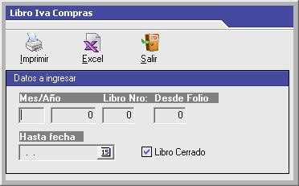
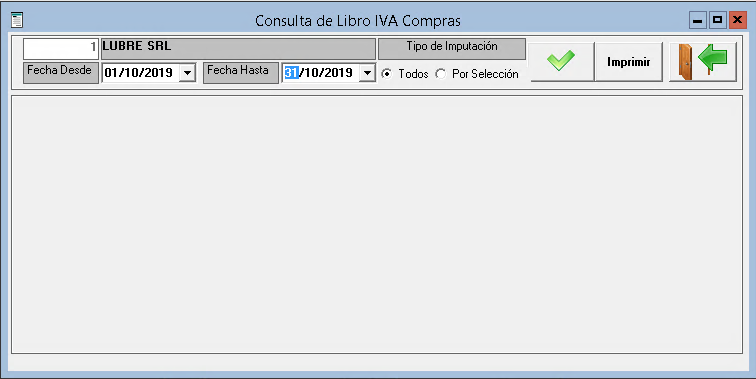

# CITI (RG3685)

## Lubre

Este procedimiento lo realizaremos con un meses de retraso, en marzo prepararemos el CITI de febrero.

Para comenzar es necesario obtener el **Libro IVA Ventas** y **Libreo IVA Compras** de Lubre los cuales serán obtenidos en archivos Excel.

| - | - |
| --- | --- |
|  | Al seleccionar cada libro, debe definir el período deseado y exportar los datos a *Excel* |
|  |  |

Ambos archivos deberán ser limpiados. Les quitamos todas las líneas de cabecera y dejamos solo los datos con los título de columnas y lo exportamos en formato CSV. 

Los grabamos en los nombres _**lubre_compras.csv**_ y **_lubre_ventas.csv_** en el directorio **datos**.

## Debo

### Libro IVA Compras

Ingresamos al perfil **Informes / Proveedores / Libro IVA Compras**, seleccionamos el rango de fechas y pulsamos en general.

Una vez obtenido el informe, pulsamos en **Imprimir** y exportamos a excel.

Quitamos las líneas de cabecera y la última línea con totales. Tambien verificamos que no existan columnas vacías en el rango de datos. Una vez que tengamos solo nombres de columnas y los datos, exportamos a CSV en el directorio **datos** con el nombre **_debo_compras.csv_**.

- - -

### Libro IVA Ventas

Ingresamos al perfil de Administración / Consultas / Libro IVA Ventas, seleccionamos rango de fechas, elegimos la opción Calendario y pulsamos en Libro.

Una vez obtenido el listado, pulsamos en Imprimir y exportamos a excel.

Quitamos las líneas de cabecera y la última línea con totales. Tambien verificamos que no existan columnas vacías en el rango de datos. 

**NOTA**: Comprobar que entre las columnas ***ImpInternos*** y ***Perc. I.V.A.*** deben existir don columnas con los siguientes nombres: ***ImpInt 1*** y ***Redondeo***. Es Necesario hacer esta comprobación por que las columnas salen renombradas diferentes o con nombres repetidos.

Una vez que tengamos solo nombres de columnas y los datos, exportamos a CSV en el directorio **datos** con el nombre **_debo_ventas.csv_**.

## Python

Nos posicionamos en la raíz del directorio (donde se encuentra el archivo main.py) y ejecutamos el comando: `python3 main.py`

Una vez terminado el proceso, tendremos nuestros archivos resultantes en el directorio **salida**.